# Roberto Alsina

Seasoned, versatile developer crafting small, durable, well‑named tools.  
Open source advocate & long‑form writer for 20+ years at [ralsina.me](https://ralsina.me).

<!-- Dark theme badge ribbon -->

  
  
  
  
  

<!-- Animated contribution banner (light/dark aware once workflow + output branch exist) -->

  <picture>
    <source media="(prefers-color-scheme: dark)" srcset="https://raw.githubusercontent.com/ralsina/ralsina/output/github-contribution-grid-snake-dark.svg">
    <source media="(prefers-color-scheme: light)" srcset="https://raw.githubusercontent.com/ralsina/ralsina/output/github-contribution-grid-snake.svg">
    
  </picture>

---

### ⚙️ Craft & Approach

- Current focus: **Python** · **Crystal**  
- Care about: clarity • correctness • minimal surface area • graceful deletion  
- Enjoy: bridging gaps with purposeful utilities; building “just enough” infrastructure  
- Guiding idea: make things future‑self friendly; bias toward boring reliability  

### 🚧 Active / Recent Projects

| Project | Summary | Tech | Stars |
|---------|---------|------|-------|
| [kv](https://github.com/ralsina/kv) | Modern remote KVM (lean, fast) | Crystal |  |
| [grafito](https://github.com/ralsina/grafito) | Clean web frontend for `journald` logs | HTML / JS |  |
| [tocry](https://github.com/ralsina/tocry) | Straightforward TODO / workflow lab | JS |  |
| [mangrullo](https://github.com/ralsina/mangrullo) | “Como un watchtower pero para gente pobre” (lightweight monitoring experiment) | Crystal | 0 |

Other exploration: [sepia](https://github.com/ralsina/sepia)

### 🧭 Legacy / Notable

- Creator of [rst2pdf](https://github.com/rst2pdf/rst2pdf) — generate PDFs directly from reStructuredText.
- Creator of [Nikola](https://github.com/getnikola/nikola) — extensible static site & blog generator.
- Long‑term stewardship mindset: keeping useful tools alive past the novelty phase.

> Preference: small composable systems over sprawling frameworks.

### ✍️ Writing

Two decades of essays & technical notes: architecture trade‑offs, tooling, sustainability, naming, pragmatic engineering.  
Read at: [ralsina.me](https://ralsina.me)

### 🧪 Philosophy (Short Form)

Build small. Name well. Delete freely. Automate tedium. Leave code your future self won’t resent.

---

### 📊 Snapshot (Combined Metrics)

  

<!-- If metrics.svg has not appeared yet, run the metrics workflow manually from the Actions tab. -->

---

### 🔗 Presence

- Website / Essays: [ralsina.me](https://ralsina.me)
- GitHub: (you are here)

---

<!-- Optional Extended Badges (uncomment if expanding)

  
  

-->

<!-- One-liner (reuse elsewhere):
Seasoned developer (Python & Crystal) building small durable tools; writing since early 2000s at ralsina.me.
-->

<!--
SETUP NOTES:
Snake: .github/workflows/snake.yml → outputs branch 'output' with snake SVGs.
Metrics: .github/workflows/metrics.yml → commits metrics.svg to main (requires METRICS_TOKEN secret if default token insufficient).
-->
